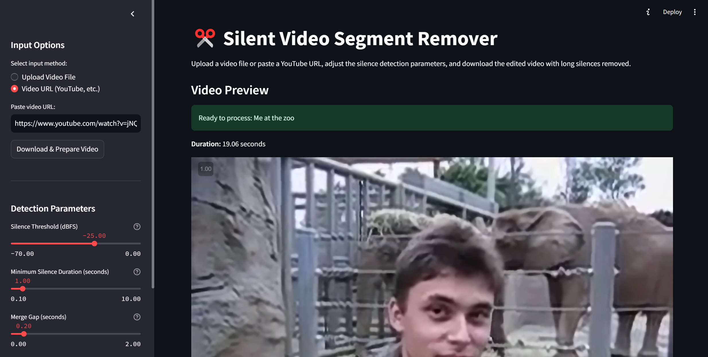

# Silent Video Segment Remover

A Streamlit application that allows users to remove silent segments from video files, making content more concise and engaging.



## Demo

Try it online: [Silent Video Editor Demo](https://silent-video-editor.streamlit.app/)

## Features

- **Multiple input options**
  - Upload local video files (MP4, MOV, AVI, MKV)
  - Paste YouTube URLs for direct processing
- **Customizable silence detection parameters**
  - Silence threshold level (dBFS)
  - Minimum silence duration to remove
  - Merge gap for connecting close non-silent segments
  - Start/end padding to prevent abrupt cuts
- **Real-time audio visualization**
  - Audio waveform display
  - RMS energy levels
  - Visual identification of silent/non-silent segments
- **One-click processing** with progress tracking
- **Instant download** of edited video

## How It Works

1. **Upload your video** via the sidebar
2. **Adjust parameters** to fine-tune detection sensitivity:
   - Lower the silence threshold (-70 to 0 dB) to detect quieter sounds as non-silent
   - Set the minimum silence duration (0.1-10s) that should be removed
   - Configure merge gap to preserve natural speech pauses
   - Add padding to prevent cutting off the beginning/end of sounds
3. **Review the audio visualization** to see how your parameters affect detection
4. **Process the video** with a single click
5. **Download the edited result** with silent segments removed

## Technical Information

The application uses several key technologies:

- **Streamlit**: For the web interface and interactive controls
- **MoviePy**: For video/audio processing and manipulation
- **NumPy**: For efficient audio signal processing
- **Matplotlib**: For generating audio visualizations

### Processing Pipeline

1. Audio extraction from the video file
2. RMS energy calculation in decibels (dBFS)
3. Silent segment detection based on threshold and duration parameters
4. Padding and merging of adjacent non-silent segments
5. Video reconstruction by concatenating non-silent segments
6. Final export with high-quality settings

## Installation

1. Clone this repository:

   ```
   git clone https://github.com/yourusername/silent-video-editor.git
   cd silent-video-editor
   ```

2. Install dependencies:

   ```
   pip install -r requirements.txt
   ```

3. Run the Streamlit app:
   ```
   streamlit run app.py
   ```

## Requirements

- Python 3.6+
- Packages listed in `requirements.txt`:
  - streamlit
  - moviepy
  - numpy
  - matplotlib
  - tqdm

## Use Cases

- **Lecture/Tutorial Editing**: Remove silent moments when the presenter pauses or writes on a board
- **Interview Processing**: Clean up content by removing long pauses between questions/answers
- **Meeting Recordings**: Make meetings more concise by removing silence and wait times
- **Video Content Creation**: Improve pacing by automatically removing unintended pauses

## Project Structure

- `app.py`: Main Streamlit application and UI
- `audio_utils.py`: Audio processing functions
- `video_utils.py`: Video manipulation utilities
- `visualization.py`: Audio visualization components
- `requirements.txt`: Required Python packages

## License

[MIT License](LICENSE)

## Contributing

Contributions are welcome! Please feel free to submit a Pull Request.

1. Fork the repository
2. Create your feature branch (`git checkout -b feature/amazing-feature`)
3. Commit your changes (`git commit -m 'Add some amazing feature'`)
4. Push to the branch (`git push origin feature/amazing-feature`)
5. Open a Pull Request
